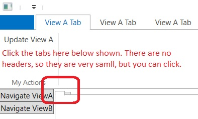

# Basic example of Tab Control. 
- This builds from the previous example 200350-RibbonRegionBehavior
- Demos how to share data context. Click update button on Ribbon View and it should update the view below.
- First define an interface.

```cs
public interface ISupportDataContext
{
    object DataContext { get; set; }
}
```


- Impliment that interface for aall of the views.
- 

```cs

```

- Now run the app.

- 

